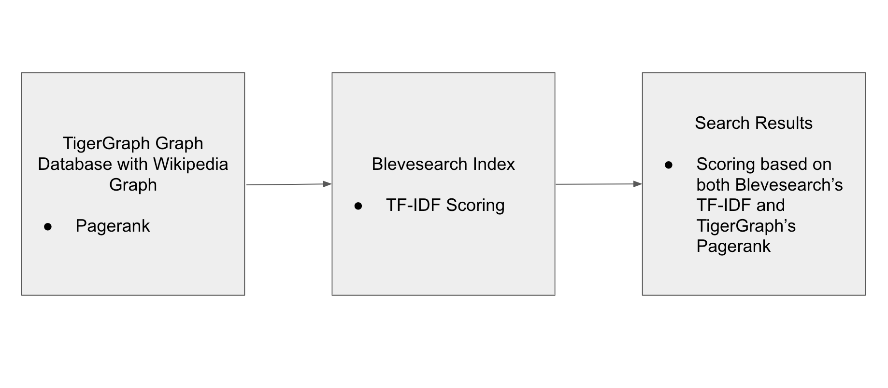
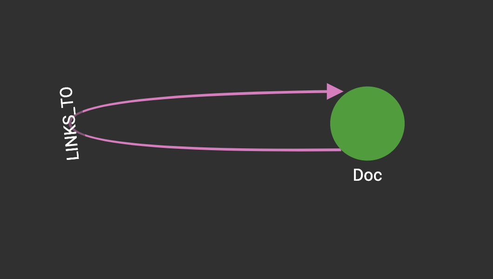

# TigerWikiSearch

A Go search tool using TigerGo, Bleve, and Gin. 

## Quickstart

```
go run .
```

Open the `index.html` from this repository in a web brower and search with the search bar!


## Workflow

This application integrates TigerGraph with Blevesearch to improve search results. The general workflow is outlined below.



The graph database is TigerGraph is modelled as shown below.



A modified Pagerank is run and the resulting vertices, scores, and text content are uploaded to a Bleve index—in this repo, [`wiki_graph.bleve`](wiki_graph.bleve). The document mapping and uploading the Pagerank results in this repo is [graph_to_bleve.go](graph_to_bleve.go). A search can then be run with Blevesearch and both the Pagerank and TF-IDF scores are considered in the final ranking and results.

The final product uses a Gin Gonic server ([main.go](main.go)) and an HTML page designed with Bootstrap ([index.html](index.html)) to communicate the search results with the frontend. 
